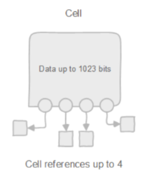
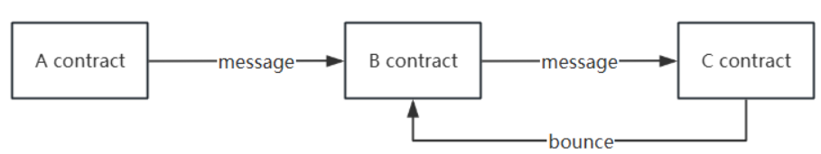
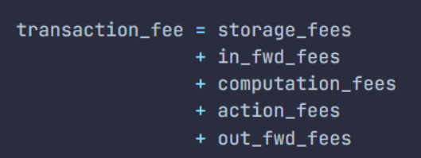

# Introduction to TON Security

TON is Telegram's fully decentralized Layer 1 blockchain for billions of users. It boasts ultra-fast transaction speeds, meager fees, and easy-to-use applications. While there are similarities between Ether and TON in terms of their overall structure and the functionality they provide, their key technical aspects and network design approaches are very different. In this study, we build a proprietary vulnerability repository for TON security and auditing in terms of security auditing and vulnerability protection.

In this study we chose the descriptive research method to start the study, which is mainly due to the specificity of the auditing industry, TON ecology lacks a large number of samples, so we need to understand and validate the existing security vulnerabilities, give a narrative and explain. In this study, we will directionally reveal TON ecology's security risks and popularize smart contract security knowledge in TON.

We will also use empirical research and case study methodology to assist the research, such as verifying the vulnerabilities through empirical testing and documenting them in the vulnerability repository.

## TON Characterization

### 1. Smart contracts need to pay gas fees for internal storage

In blockchain, any data stored on the chain is eternal, and then someone needs to pay for that eternally stored data. In Ether, the contract deployer only needs to pay once when the contract is deployed, while the subsequent cost of storing the data is paid by the miners as an infrastructure cost.

In TON, each smart contract is required to hold a certain amount of TON token balance, and the smart contract's balance is used to pay for storage on the chain. If the balance of a smart contract is not enough to pay for this storage fee, then the contract will enter a frozen state, and it is necessary to transfer several TON tokens that is enough to pay for the storage fee to be able to unfreeze the contract, and if it is not unfrozen after a certain period, then the contract will be deleted.

### 2. Each user's wallet is a smart contract

In Ethereum, the address is divided into an external account address and a contract address, the external account address has its own private key and public key, held by the user, the user through the private key to control the address to send out transactions to the smart contract. In TON, there is no external account address, the wallet held by the user is also a smart contract, and the wallet address is calculated from the wallet contract code and its initialization parameters (including the user's public key), the user needs to send transactions to the wallet contract through the private key, and then forward the transactions to other contracts.

### 3. Calls between smart contracts are asynchronous

In Ethernet, every transaction is atomic, when a smart contract calls a method of a different smart contract, the call will be immediately processed in the same transaction, where an exception in every link will lead to the rollback of the whole transaction, which has given rise to the birth of lightning loans, a rather defi charismatic business.
In TON, calls between smart contracts are completely asynchronous, and calls between contracts may be split across multiple different blocks. By the time a contract receives a message sent by another contract, several blocks may have passed, and the state may have changed multiple times by this time, so potential errors will occur more frequently.

### 4. No synchronized status acquisition between contracts

In Ether, it is very common for contracts to get real-time status from each other, such as checking the token balance or checking the price of a pair of transactions, etc. However, in TON, this is nearly impossible due to the asynchronous message sending. However, in TON, this is nearly impossible due to the asynchronous sending of messages. When a contract receives the state from another contract, the state at that time may not be the same as when the message was sent due to the difference in blocks.

### 5. Smart contracts in TON are all mutable

The code of smart contracts in Ethernet is established as immutable at the very beginning of the design, and can never be modified, of course, the emergence of scalable contracts solves this limitation, but it also makes the operation cumbersome.TON discards the feature of the immutability of smart contracts, and in the func language, the developer can choose to write the contract code as a variable in the contract, and when there is a variable of the code in the contract, the contract is mutable. When there is a code variable in the contract, the contract is mutable, and this design abandons the complexity of scalable contracts.

## Difference between TVM and EVM

### 1. Storage structure

EVM: Uses a 256-bit key to a 256-bit value mapping method, the basic storage unit is a 256-bit integer.

TVM: relies on the "Bags of Cell" architecture, the underlying data is a 1023-bit cell, a cell can refer to four other cells, and each cell can only be referenced once, through the continuous downward tree structure to expand the infinite data structure.



### 2. Fallback mechanisms

EVM: any inter-contract call in the same transaction is atomic, a fallback in the entire transaction generated by the state changes are all rolled back.
TVM: a fallback will only rollback within the current contract call and send a bounce message to the previous contract, if it receives the bounce message, it can manually rollback the previous state, if it does not receive it, it may lead to problems with the state of the previous and previous contracts.



### 3. Gas calculations

EVM: The Ethernet Virtual Machine processes each transaction one at a time, based on the instructions identified in the transaction, each of which has an explicitly defined amount of Gas consumed. For example, performing an additional operation consumes 3Gas, so the amount of Gas consumed by a transaction depends entirely on the cumulative Gas of all the instructions in the transaction, and the VM will provide feedback on the total amount of Gas consumed when the transaction is completed.

TVM: Unlike EVM, the execution of a transaction in TVM is divided into multiple phases, each of which generates a corresponding amount of gas, using the official formula for calculating gas as an example:



storage_fees: Fees paid for storing smart contracts on the blockchain.

In_fwd_fees: Fees for importing messages from outside the blockchain.

computation_fees: Fees for executing code in a virtual machine.

action_fees: Fees charged by the smart contract for sending external messages.

out_fwd_fees: Fees for sending messages from the TON blockchain to external services and external blockchains (currently 0).

TON can change the gas configuration on the chain via a vote on the main net, which may result in a large change in the gas fee.

### 4. Split Chain

EVM: Ethernet completes transactions on a single blockchain, and the scaling solution relies heavily on sidechain and layer2 solutions.

TVM: TON has a main chain and allows the creation of up to 2^32 working chains, each of which can be subdivided into up to 2^60 slices. Currently, only the main chain (workchain_id=-1) and occasional basic workchains (workchain_id=0) run in the TON blockchain. Each smart contract address is preceded by a 32-bit chain id that is used to identify and link to smart contract addresses in different working chains. Below is an example of a raw smart contract address using the workchain ID and account ID (denoted as workchain_id and account_id):

-1:fcb91a3a3816d0f7b8c2c76108b8a9bc5a6b7a55bd79f8ab101c52db29232260

-1 indicates the chain ID belonging to the master chain.

### 5. Data Types 

EVM: supports data structures such as signed/unsigned integers, booleans, addresses, arrays, and custom structures.

TVM: TON natively supports only integers, cells, slices, Continuation, Tensors, and other data structures, func currently does not support customized data structures, tact adds boolean, string, address, and other common data structures for smart contracts based on the above types.

# Vulnerability Type
## GAS Limitation

The gas in the TON chain comes from ctx.value, that is to say, the msg.value on the ETH chain and the gas fee are combined into one. First of all, if you need to recharge the TON native coin TON, you need to subtract the gas value needed for this transaction from this basis, otherwise, it is equivalent to this transaction by the contract to pay for the gas. and since the gas fee is controlled by the user, you can control the gas fee to make the contract in a certain step of the gas fee is not enough so that the problem of backing out occurs. For example:

```tact
const ACC_PRECISION: Int = pow(10, 20);
contract masterChef{
    totalsupply: Int as uint64;
    minichef: Address;
    lastRewardBlock: Int as uint64;
    rewardPerSecond: Int as uint64;
    accRewardPerShare: Int as uint64;
    init(minichef: Address) {
        self.minichef = minichef;
        self.totalsupply = 0;
        self.lastRewardBlock = 0;
        self.rewardPerSecond = 1000;
        self.accRewardPerShare = 0;
    }
    receive(msg: Deposit) { 
        self.updatePool();
        self.totalsupply += msg.amount;
        msg.toCell().send_to(self.minichef);
    }

    receive(msg: Withdraw) { 
        self.updatePool();
        self.totalsupply -= msg.amount;
        msg.toCell().send_to(self.minichef);
    }

    receive(msg: WithdrawReply) { 
        msg.toCell().send_to(self.minichef);
        self.sendJetton(msg.amount,msg.sender);
    }
    inline fun updatePool() {
        if (self.totalsupply > 0 ) {
            let reward: Int = (now() - self.lastRewardBlock) * self.rewardPerSecond;
            let rewardAmount: Int = ACC_PRECISION * reward /self.totalsupply;
            self.accRewardPerShare = self.accRewardPerShare + rewardAmount;
        } 
        self.lastRewardBlock = now();
    }
}
contract miniChef{
    owner: Address;
    masterchef: Address;
    amount: Int as coins = 0;
    init(owner: Address,masterchef: Address) {
        self.owner = owner;
        self.masterchef = masterchef;
        
    }
    receive(msg: Deposit) { 
        require(sender() == self.masterchef ,"not masterchef");
        self.amount += msg.amount;
    }

    receive(msg: Withdraw) { 
        require(sender() == self.masterchef ,"not masterchef");
        require(self.amount >= msg.amount,"not enough balance");
        self.amount -= msg.amount;
        WithdrawReply {
            amount: msg.amount,
            sender: msg.sender
        }.toCell().send_to(self.masterchef);
    }
}
```

In the above two contracts, the `masterChef` contract is the entry contract, `miniChef` is the contract owned by each user individually, and the default `Deposit` message has the same opcode as `JettonTransferNotification`, that is, the default user has already been transferred to jetton at this time.

When the wallet of `masterChef` sends a `Deposit` to `masterChef`, the logic in the `masterChef` contract is executed successfully, and the `Deposit `message is sent to `miniChef`, but there is insufficient gas during the execution of the `Deposit` message in `miniChef`, which will lead to the situation that user's jetton has been sent but there is not enough gas in the `miniChef` does not have the corresponding balance of the corresponding user, resulting in the user not being able to withdraw the money, and the sent jetton can not be retrieved, and the `totalSupply` in the `masterChef` contract has been increased, which will also lead to errors in the calculation of the subsequent rewards.

When the user deposits the jetton normally, at this time call the `Withdraw` message but pass in a small gas fee, let the transaction execution in the `miniChef` in the `Withdraw` message with insufficient gas failure, will not cause a loss of the user's deposit, but will lead to the `totalSupply` in the `masterChef` contract to reduce repeated execution can be made `totalSupply` a very small value, resulting in more rewards being issued for the user.

**Risk level: Critical**

## UnBounced Message

Due to the asynchronous nature of the TON chain, it is very easy to have different states in a complex call flow, to solve this situation, TON natively provides a bounce handling mechanism, so that the contract can manually call back to the previously changed state variables. However, the current bounce message can only carry 224 bits of valid data, while an address in TON has 256 bits, the data that can be carried is very limited, which is a big limitation that may be fixed later.

For example:

```tact
contract masterChef{
    totalsupply: Int as uint64;
    minichef: Address;
    lastRewardBlock: Int as uint64;
    rewardPerSecond: Int as uint64;
    accRewardPerShare: Int as uint64;
    init(minichef: Address) {
        self.minichef = minichef;
        self.totalsupply = 0;
        self.lastRewardBlock = 0;
        self.rewardPerSecond = 1000;
        self.accRewardPerShare = 0;
    }
    receive(msg: Deposit) { 
        self.updatePool();
        self.totalsupply += msg.amount;
        msg.toCell().send_to(self.minichef);
    }

    receive(msg: Withdraw) { 
        self.updatePool();
        self.totalsupply -= msg.amount;
        msg.toCell().send_to(self.minichef);
    }

    receive(msg: WithdrawReply) { 
        msg.toCell().send_to(self.minichef);
        self.sendJetton(msg.amount,msg.sender);
    }
    inline fun updatePool() {
        if (self.totalsupply > 0 ) {
            let reward: Int = (now() - self.lastRewardBlock) * self.rewardPerSecond;
            let rewardAmount: Int = ACC_PRECISION * reward /self.totalsupply;
            self.accRewardPerShare = self.accRewardPerShare + rewardAmount;
        } 
        self.lastRewardBlock = now();
    }
}
contract miniChef{
    owner: Address;
    masterchef: Address;
    amount: Int as coins = 0;
    init(owner: Address,masterchef: Address) {
        self.owner = owner;
        self.masterchef = masterchef;
        
    }
    receive(msg: Deposit) { 
        require(sender() == self.masterchef ,"not masterchef");
        self.amount += msg.amount;
    }

    receive(msg: Withdraw) { 
        require(sender() == self.masterchef ,"not masterchef");
        require(self.amount >= msg.amount,"not enough balance");
        self.amount -= msg.amount;
        WithdrawReply {
            amount: msg.amount,
            sender: msg.sender
        }.toCell().send_to(self.masterchef);
    }
}
```

When sending `Withdraw` messages for withdrawals, since `miniChef`'s `Withdraw` message has a require check that checks `self.amount` against `msg.amount`, if the amount passed in by the user is greater than their contract balance, `miniChef` will keep backing out, which will cause the `totalSupply` variable to continually becomes smaller, and the user receives an abnormally large reward.

**Risk Level: Critical**

## Competitive Conflict

Because all contracts in a TON transaction are executed asynchronously, it is possible to continue to send the same message to bypass limits such as balances or boolean values after a contract in the transaction has been executed, if the state has not been modified. For example:

```tact
contract JettonWallet{
    balance: Int as uint64 = 0;
    owner: Address;
    init(owner: Address){
        self.owner = owner;
    }

    receive(msg: Transfer){
        require(self.balance >= msg.amount, "not enough balance");
        InternalTransfer{
            amount: msg.amount,
            sender: msg.senderWallet
        }.toCell().send_to(msg.receiverWallet);
    }

    receive(msg: InternalTransfer){
        self.balance += msg.amount;
        TransferReply{
            amount: msg.amount,
        }.toCell().send_to(msg.sender);
    }

    receive(msg: TransferReply){
        self.balance -= msg.amount;
    }
}
```

In this simple Jetton implementation, the contract implements the following flow: 


The above flow may have competing problems, e.g., wallet A has a balance of 5 Jetton, it can send a message to wallet B to transfer 5 Jetton twice, and since A's Jetton balance is not deducted in the first step, both of them can send `InternalTransfer` messages to wallet B without any problem, and wallet B's balance can be increased twice, and B will receive 10 Jetton, even if there is an exception in the third step when the balance is not enough, it will not be rolled back.

**Risk level: Critical**

## Unbounded Data Structure

The underlying TVM uses a cell approach to store data, the mapping is implemented as a unit tree, and writing to a leaf in the tree requires writing a new hash along the entire height. If an attacker tries to spam transaction keys in the mapping, some user balances will be pushed so deep into the tree that updating them will exceed the gas limit (currently capped at 1TON per contract). Example:

```tact
contract stakePool{
    totalSupply: Int as uint32 = 0;
    userBalance: map<Address,Int>;

    receive("deposit") {
        let ctx: Context = context();
        require(ctx.value > ton("0.001"), "not enough gas");
        let stakeAmnount: Int = ctx.value - ton("0.001");
        let prevBal: Int? = self.userBalance.get(ctx.sender);
        if (prevBal == null){
            self.userBalance.set(ctx.sender,stakeAmnount);
        }else{
            self.userBalance.set(ctx.sender,prevBal!! +stakeAmnount);
        }

    }

    receive(msg: Withdraw) {
        let ctx: Context = context();
        let prevBal: Int = self.userBalance.get(ctx.sender)!!;
        require(prevBal >= msg.amount,"not enough balance");
        require(ctx.value > ton("0.001"),"not enough gas");
        self.userBalance.set(ctx.sender, prevBal- ctx.value);
        send(SendParameters{
                to: msg.receiver,
                value: msg.amount,
                mode: SendRemainingValue + SendIgnoreErrors,
                bounce: false,
                body: WithdrawExcesses {
                    amount: msg.amount
                }.toCell()
            });

    }
    
}
```

It's a very simple pledge contract, and this architecture is common on Ether, but in the TON, once too many user addresses are involved, or too much spam data is added by malicious actors, it can lead to some user's data being pushed into deep references in the cell store, making modifying their data consume so much gas that it exceeds the gas limit, making the balance inaccessible to those users. 

To avoid generating too much data, it is recommended to use contract slicing, that is, splitting a logical contract into multiple different chunks. Taking the pledge contract as an example, if each user's data, including takeAmount, rewardDebet, reward, etc., is stored in the same contract with totalSupply in the pool when the number of users increases to a certain amount When the number of users increases to a certain number, it may lead to excessive gas consumption when querying the data, therefore, a separate contract can be set up for each user, such as the miniChef contract above, which stores the user's data separately from the pool data, and will not cause unnecessary gas consumption or even dos problems due to too many users, and the implementation of the TON Jettons also uses this model.

**Risk Level: Critical**

## Over-reliance States

In Solidity, state queries between contracts occur very frequently, e.g., to query the contract balance, to query the current price of a pair, etc. In TON, however, relying too much on the state of other contracts can cause serious problems. However, in TON, over-reliance on the states of other contracts can cause serious problems, e.g.:

```tact
contract aggregator{
    pair: Address;
    USDCWallet: Address;
    init(pair: Address, USDCWallet: Address) {
        self.pair = pair;
        self.USDCWallet = USDCWallet;
    }
    receive(msg: SwapJettonNotification) { 
        require(sender() == self.USDCWallet, "Unauthorized sender"); 
        GetAmountOut {
            amountIn: msg.amount,
            minReturnAmount : msg.minReturnAmount,
            sender: msg.sender
        }.toCell().send_to(self.pair);
    }

    receive(msg: SwapReply) { 
        require(sender() == self.pair, "Unauthorized sender"); 
        /*
        Execute the subsequent swap logic
        */
    }
}

contract pair{
    reserve0: Int as coins;
    reserve1: Int as coins;
    aggregator: Address;
    init(aggregator: Address) {
        self.aggregator = aggregator;
        self.reserve0 = 0;
        self.reserve1 = 0;
    }
    receive(msg: GetAmountOut) { 
        let returnAmount: Int =msg.amountIn *self.reserve0/self.reserve1;
        require(returnAmount>= msg.minReturnAmount,"not enough Amount");
        SwapReply {
            amountIn: msg.amountIn,
            sender: msg.sender
        }.toCell().send_to(self.aggregator);
    }
}
```

Since the interaction between contracts in TON can only be carried out by sending internal messages and cannot be directly queried by get and other functions, the demo performs swap transactions in the following order: the `aggregator` contract receives the `SwapJettonNotification` message - sends a `GetAmountOut` message to the pair contract to query whether the current price meets the `minReturnAmount` requirement - if the price meets the requirement, sends a `SwapReply` to the `aggregator` contract to execute the subsequent swap logic. Send a `GetAmountOut` message to the `pair` contract to check whether the current price meets the requirement of `minReturnAmount` -- If the price meets the requirement, then send `SwapReply` to the `aggregator` contract to execute the subsequent swap logic.

In a public chain with atomic transactions, this process does not cause problems, but due to the asynchronous nature of the TON, none of the above three steps may be in a single block. When the price is queried in the second step, the price may still change, resulting in the tokens eventually being exchanged to the user's hands not meeting the minimum return tokens, but at this time the transaction does not cause problems but is executed normally.

**Risk Level: High**

## Message Pattern Error

There are many message patterns for delivering messages in TON, and you need to choose the message pattern carefully when you send a message. For example, there is `SendRemainingBalance`, which will forward all the balances in the contract to the receiver, and it is usually used together with the message pattern `SendDestroyIfZero` to destroy the contract, which destroys the contract and sends the remaining TON to the receiver, similar to the self-destruct function in the previous Ether. It will destroy the contract and send the remaining TON to the receiver, similar to the previous self-destruct function on Ether. One of the most commonly used message mode is `SendRemainingValue`, using this mode to send a message will forward the remaining gas fee together to the receiver, it will be very convenient to execute in a linear message flow, and it is also a method to recover the gas at the end of the message flow. However, if other processing logic still exists after the message is sent, such as sending events or changing state, it will consume the balance of the contract itself. Example:

```tact
contract userWallet{
    owner: Address;
    master: Address;
    amount: Int as coins = 0;
    init(owner: Address,master: Address) {
        self.owner = owner;
        self.master = master;
        
    }
    receive(msg: Deposit) { 
        require(sender() == self.master ,"not masterchef");
        self.amount += msg.amount;
    }

    receive(msg: Transfer) { 
        require(sender() == self.owner ,"not masterchef");
        require(context().value >= ton("0.005"),"not enough gas");
        self.amount -= msg.amount;
        send(SendParameters{
                to: self.master,
                value: msg.amount,
                mode: SendRemainingValue + SendIgnoreErrors,
                bounce: false,
                body: Transfer {
                    amount: msg.amount,
                    receiverWallet: msg.receiverWallet
                }.toCell()
            });
        emit(TransferEvent{sender: self.owner, receiver: msg.receiverWallet, amount: msg.amount}.toCell());
    }

}
```

In the `userWallet` contract, the Transfer message uses `SendRamainingValue` to send a `Transfer` message to the master and triggers the `TransferEvent` event at the end of the contract. Since the gas fee carried by this message has already been sent to the `master` contract with the message, the triggering of this event consumes the internal balance of the contract, and as the number of transactions increases, each event will consume a part of the contract balance, resulting in the contract balance going to zero and freezing.

**Risk level: High**

## Incorrect Checksum Rules

The Jetton standard in TON does not currently have a transferFrom function, so many contracts use the transfer_notification message in the Jetton standard as the start message for a swap or deposit transaction. other problems due to asynchrony. However, if a fallback issue occurs in the execution flow, it can result in the user's assets sustaining a loss, for example:

```tact
contract stakePool{
    totalsupply: Int as uint64;
    userPool: Address;
    lpTokenWallet: Address;
    init(userPool: Address,lpTokenWallet: Address) {
        self.userPool = userPool;
        self.totalsupply = 0;
        self.lpTokenWallet = lpTokenWallet;

    }
    receive(msg: JettonNotification) { 
        require(context().value >= ton("0.05"),"insufficient gas");
        require(context().sender == self.lpTokenWallet,"incorrect jetton");
        self.totalsupply += msg.amount;
        msg.toCell().send_to(self.userPool);
    }

    receive(msg: Withdraw) { 
        require(context().value >= ton("0.05"),"insufficient gas");
        msg.toCell().send_to(self.userPool);
    }

    receive(msg: WithdrawReply) { 
        self.totalsupply -= msg.amount;
        self.sendJetton(msg.amount,msg.sender);
    }
}
contract userPool{
    owner: Address;
    stakePool: Address;
    amount: Int as coins = 0;
    init(owner: Address,stakePool: Address) {
        self.owner = owner;
        self.stakePool = stakePool;
        
    }
    receive(msg: Deposit) { 
        require(sender() == self.stakePool ,"not masterchef");
        self.amount += msg.amount;
    }

    receive(msg: Withdraw) {
        require(sender() == self.stakePool ,"not masterchef");
        require(self.amount >= msg.amount,"not enough balance");
        self.amount -= msg.amount;
        WithdrawReply {
            amount: msg.amount,
            sender: msg.sender
        }.toCell().send_to(self.stakePool);
    }
}
```

The `stakePool` contract uses `JettonNotification` as the entry point for deposits and checks whether the gas is enough to satisfy the entire message flow. The contract uses require in the message to check whether the gas meets the requirements, but at this time the user has already transferred Jetton to the corresponding wallet of the contract, this time throwing an exception will result in the user transferring tokens not being taken out and thus locked up. The correct way to do it is to use the if check, and if it triggers the if block, then the user's incoming jetton will be sent back to the user's wallet.

**Risk level: Medium**

## Erroneous Assertions in the Message Flow

Due to the current problems with the bounce mechanism, it cannot be used as a means of preventing message processing failures and incomplete execution. Therefore, in the entry message of the entire message flow, it is necessary to check as much as possible all the contents that can be checked in the first step, to minimize the possibility of errors in subsequent messages, and minimize the use of required and other checking statements in the subsequent message, because a require failure may lead to the termination of the entire message flow. Because a required failure may lead to the termination of the entire message flow, it is prudent to check before use whether this fallback will lead to a state exception in the part of the message flow before this. For example:

```tact
contract master{
    owner: Address;
    master: Address;
    jettonWallet: Address;
    walletAddress: map<Address, Address>;
    init(owner: Address,master: Address, jettonWallet: Address) {
        self.owner = owner;
        self.master = master;
        self.jettonWallet = jettonWallet;
    }
    receive(msg: JettonNotification) { 
        require(sender() == self.jettonWallet, "incorrect jetton");
        if(context().value >= ton("0.05")){
            self.sendJetton(msg.amount,msg.sender);
            return;
        }
        let wallet: Address = self.walletAddress.get(msg.sender)!!;
        Deposit{
            amount: msg.amount,
            sender: msg.sender
        }.toCell().send_to(wallet);
    }

    receive(msg: Transfer) { 
        require(sender() == self.walletAddress.get(msg.senderWallet)!! ,"not masterchef");
        Deposit{
            amount: msg.amount,
            sender: msg.senderWallet
        }.toCell().send_to(self.walletAddress.get(msg.receiverWallet)!!);
    }

   
}
contract userWallet{
    owner: Address;
    master: Address;
    amount: Int as coins = 0;
    init(owner: Address,master: Address) {
        self.owner = owner;
        self.master = master;
        
    }
    receive(msg: Deposit) { 
        require(sender() == self.master ,"not masterchef");
        self.amount += msg.amount;
    }

    receive(msg: Transfer) { 
        require(sender() == self.owner ,"not masterchef");
        require(context().value >= ton("0.005"),"not enough gas");
        self.amount -= msg.amount;
        msg.toCell().send_to(self.master);
    }

   
}
```

In the above code, after the user deposits the jetton into the `userWallet` contract through the `master` contract, at this point, when the user wants to transfer his internal balance to another user through the `Transfer` message when the message is successfully forwarded to the `master` contract if there is an error in the sender in the message, an exception is thrown and no corresponding amount is added to the recipient's The `userWallet` balance will not be increased by the corresponding amount, but at this point the `userWallet` has already been deducted from the user's balance, resulting in the assets that the user wants to transfer being locked up in the contract.

**Risk Level: Medium**

## Gas Recovery
Due to the above vulnerability, the developer will limit the number of incoming gas at the beginning of the message flow, even if it is the same entry function, the message flow will not execute all branches every time under certain circumstances, and some messages will be skipped in the middle of the flow, and the gas saved by these skipped messages will need to be refunded to the user. Strictly speaking, this will not lead to some serious problems in the contract, it will only keep the remaining gas in the contract, but it will make the user pay more commission than normal, so it is still recommended to refer to Jetton's standard implementation to return the excess gas as an EXIT message to the user, which is implemented by Jetton as follows:

```tact
// 0xd53276db -- Cashback to the original Sender
        if (msg.response_destination != null) { 
            send(SendParameters {
                to: msg.response_destination, 
                value: msgValue,  
                bounce: false,
                body: TokenExcesses { 
                    queryId: msg.queryId
                }.toCell(),
                mode: SendIgnoreErrors
            });
        }
```

**Risk Level: Low**